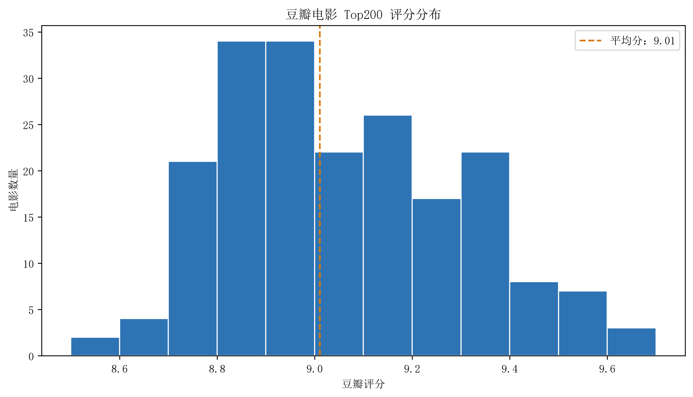
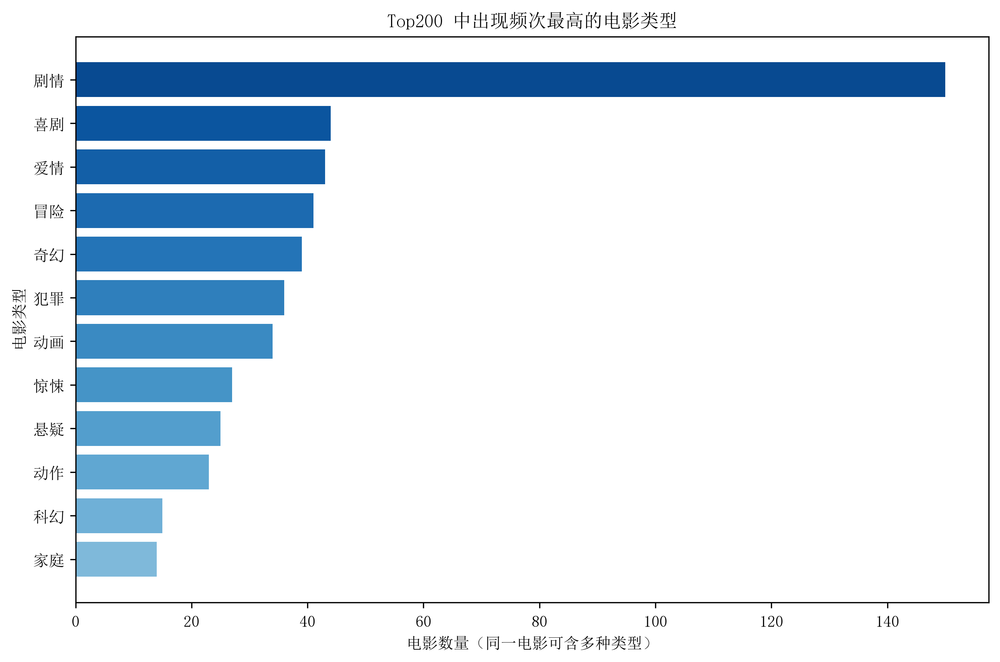
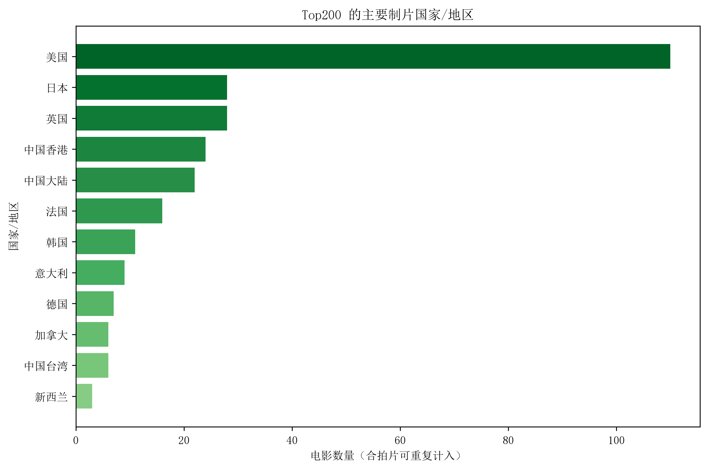
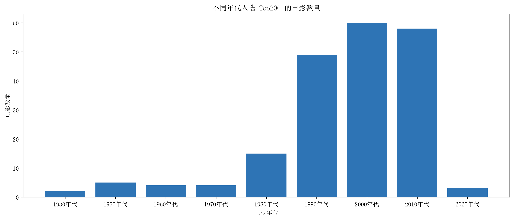
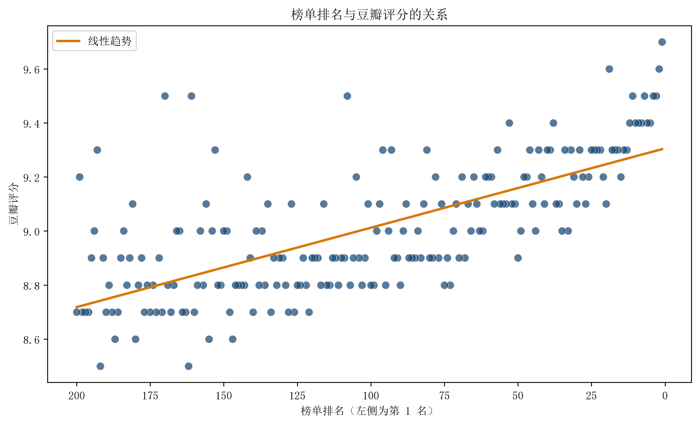
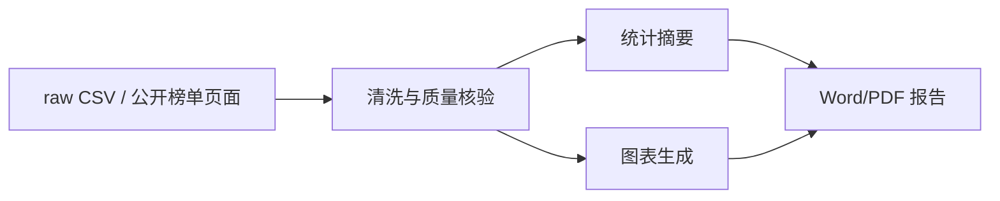

# Douban Movie Top200 Analysis Results

本项目分析了豆瓣电影 Top250 公开榜单前 200 部影片，重点展示榜单电影的评分分布、类型结构、国家/地区来源、年代分布和排名关系。仓库后半部分提供完整可复现流程，可以从已保存原始数据重新生成清洗数据、图表和报告。

## Download Release

原始 CSV 和展示版报告已放在 GitHub Release 中，适合直接下载查看：

- [Release: Douban Top200 results and reproducible dataset](https://github.com/zl097932-ai/douban-top200-data-analysis/releases/tag/v1.0.0-results)
- `douban_top200_raw.csv`：原始榜单 CSV，用于离线复现。
- `douban_top200_github_showcase_report.pdf`：结果展示版 PDF。
- `douban_top200_github_showcase_report.docx`：可编辑的结果展示版 Word。

## Results At A Glance

当前数据集包含 **200** 部电影，年份跨度为 **1936-2023**，平均评分为 **9.01**，累计评价人数约 **1.89 亿**。

| 指标 | 结果 |
|---|---:|
| 电影数量 | 200 |
| 平均评分 | 9.01 |
| 中位评分 | 9.00 |
| 评分范围 | 8.5-9.7 |
| 年份跨度 | 1936-2023 |
| 累计评价人数 | 188,548,326 |
| 出现最多的类型 | 剧情 |
| 出现最多的国家/地区 | 美国 |
| 影片最多的年代 | 2000 年代 |

## Key Findings

- **高分段集中**：Top200 电影评分集中在 8.8-9.3 区间，整体评分水平很高，平均分为 9.01。
- **剧情片占据主体**：剧情类型出现 150 次，显著高于喜剧、爱情、冒险、奇幻等类型。
- **地区来源集中**：美国电影出现 110 次，英国、日本、中国香港、中国大陆、法国等也有较高出现频次。
- **年代分布明显**：1990 年代、2000 年代和 2010 年代影片构成榜单主体，其中 2000 年代数量最多。
- **排名与评分相关**：排名越靠前评分整体越高；评分与评价人数之间的线性相关性较弱。

## Visual Results

### 评分分布



### 热门类型



### 主要国家/地区



### 年代分布



### 排名与评分关系



## What Was Produced

| 输出 | 说明 |
|---|---|
| `data/processed/movies_clean.csv` | 清洗后一电影一行的主数据表 |
| `data/processed/movies_by_genre.csv` | 类型展开表，用于统计多类型电影 |
| `data/processed/movies_by_country.csv` | 国家/地区展开表，用于统计合拍片来源 |
| `data/processed/analysis_summary.json` | 自动生成的统计摘要 |
| `data/processed/data_quality_report.json` | 数据质量检查结果 |
| `output/figures/` | 7 张分析图表 |
| `output/报告/豆瓣电影Top200数据分析报告_GitHub展示版.docx` | 面向 GitHub 展示的 Word 报告 |
| `output/报告/豆瓣电影Top200数据分析报告_GitHub展示版.pdf` | 面向 GitHub 展示的 PDF 报告 |

常用交付文件也已整理到 [Release assets](https://github.com/zl097932-ai/douban-top200-data-analysis/releases/tag/v1.0.0-results)，其中包含原始 CSV、展示版 PDF 和展示版 Word。

## Reproducible Workflow

项目支持两种复现方式：使用仓库内已保存的原始 CSV 离线复现，或重新访问公开榜单页面刷新数据。



### 1. 安装依赖

```powershell
python -m venv .venv
.\.venv\Scripts\python.exe -m pip install -r requirements.txt
```

### 2. 离线复现全部结果

```powershell
.\.venv\Scripts\python.exe run_pipeline.py --skip-fetch --student-name "你的姓名" --student-id "你的学号" --class-name "你的班级"
```

### 3. 重新采集并刷新结果

```powershell
.\.venv\Scripts\python.exe run_pipeline.py --fetch --student-name "你的姓名" --student-id "你的学号" --class-name "你的班级"
```

### 4. 单独重建 GitHub 展示版报告

```powershell
.\.venv\Scripts\python.exe scripts\build_github_showcase_report.py
```

如需导出 PDF，电脑需要安装桌面版 LibreOffice；主流程也支持通过 `--soffice` 指定 `soffice.com` 路径。

## Project Structure

```text
.
├── data/
│   ├── raw/                  # 原始 Top200 CSV
│   └── processed/            # 清洗结果、展开表、质量报告和统计摘要
├── docs/
│   ├── project_overview.md
│   └── data_dictionary.md
├── output/
│   ├── figures/              # 分析图表
│   ├── logs/                 # 运行追溯日志
│   └── 报告/                 # DOCX/PDF 报告
├── scripts/
│   └── build_github_showcase_report.py
├── src/
│   ├── crawler.py            # 页面抓取与解析
│   ├── processing.py         # 清洗、统计和图表生成
│   └── reporting.py          # 课程版报告生成与 PDF 导出
├── tests/                    # 自动化测试
├── run_pipeline.py
└── requirements.txt
```

## Tests

```powershell
.\.venv\Scripts\python.exe -m pytest -q
```

测试覆盖 HTML 页面解析、字段清洗、重复处理、类型/国家地区拆分和统计摘要生成。

## Data Use Notes

数据仅用于课程学习与项目展示。采集逻辑只访问无需登录的公开列表页，并设置随机等待、失败重试和离线复现机制。榜单内容会随网站更新而变化，因此本仓库中的数据和报告代表当次运行结果，不代表电影市场或平台整体分布。
