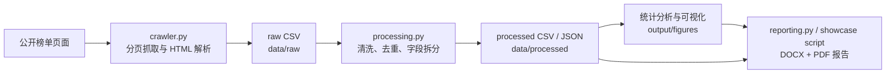

# Douban Movie Top200 Data Pipeline

一个从公开榜单采集到自动化报告生成的 Python 数据分析项目。项目围绕豆瓣电影 Top250 公开榜单的前 200 部影片，完成数据采集、清洗、质量核验、探索性分析、可视化和 Word/PDF 报告输出。

本仓库保留课程作业的完整交付物，同时以更适合 GitHub 和简历展示的方式组织代码、数据和文档。

## Project Highlights

- **端到端数据管道**：从公开页面采集、HTML 解析、字段清洗、统计分析到报告生成，流程可一键复现。
- **离线可复现**：仓库已保存原始 CSV，可在不访问网络的情况下重建清洗数据、图表和报告。
- **质量核验**：对记录数、排名唯一性、关键字段缺失、重复电影等进行自动检查。
- **自动化可视化**：输出评分分布、类型分布、国家/地区分布、年代分布和相关关系等 7 张图表。
- **报告自动生成**：使用 `python-docx` 生成中文 Word 报告，并可通过 LibreOffice 导出 PDF。
- **测试覆盖核心逻辑**：使用 `pytest` 验证页面解析、数据清洗、去重、拆分和统计摘要。

## Result Snapshot

当前数据集共包含 **200** 部电影，年份跨度为 **1936-2023**，平均评分为 **9.01**，评分范围为 **8.5-9.7**，累计评价人数约 **1.89 亿**。

| 指标 | 结果 |
|---|---:|
| 电影数量 | 200 |
| 平均评分 | 9.01 |
| 中位评分 | 9.00 |
| 最高评分 | 9.70 |
| 最低评分 | 8.50 |
| 年份跨度 | 1936-2023 |
| 累计评价人数 | 188,548,326 |

主要观察：

- Top200 影片高度集中在剧情、喜剧、爱情、冒险和奇幻等类型，其中剧情片出现 150 次。
- 制片国家/地区中，美国电影出现 110 次，中国香港、中国大陆、日本、英国等也占据较高比例。
- 1990 年代和 2000 年代影片数量最多，构成榜单主体。
- 排名与评分之间存在明显的负相关关系，排名越靠前评分总体越高；评分与评价人数的线性相关性较弱。


## Data Pipeline



## Tech Stack

| 模块 | 技术 |
|---|---|
| 数据采集 | `requests`, `BeautifulSoup4` |
| 数据处理 | `pandas`, `numpy` |
| 统计分析 | `scipy` |
| 可视化 | `matplotlib` |
| 报告生成 | `python-docx`, LibreOffice |
| PDF/页面渲染 | `PyMuPDF` |
| 测试 | `pytest` |

## Repository Structure

```text
.
├── data/
│   ├── raw/                  # 原始 Top200 CSV
│   └── processed/            # 清洗结果、展开表、质量报告和统计摘要
├── docs/
│   ├── project_overview.md   # 项目设计、流程和交付说明
│   └── data_dictionary.md    # 字段字典与输出文件说明
├── output/
│   ├── figures/              # 自动生成的分析图表
│   ├── logs/                 # 运行追溯日志
│   └── 报告/                 # 课程提交版与 GitHub 展示版报告
├── scripts/
│   └── build_github_showcase_report.py
├── src/
│   ├── crawler.py            # 页面抓取与解析
│   ├── processing.py         # 清洗、统计和图表生成
│   └── reporting.py          # 课程版报告生成与 PDF 导出
├── tests/                    # 自动化测试
├── run_pipeline.py           # 一键运行入口
├── requirements.txt
└── README.md
```

## Quick Start

在项目根目录创建环境并安装依赖：

```powershell
python -m venv .venv
.\.venv\Scripts\python.exe -m pip install -r requirements.txt
```

使用仓库中已保存的原始数据离线复现完整流程：

```powershell
.\.venv\Scripts\python.exe run_pipeline.py --skip-fetch --student-name "你的姓名" --student-id "你的学号" --class-name "你的班级"
```

重新访问公开榜单并刷新数据：

```powershell
.\.venv\Scripts\python.exe run_pipeline.py --fetch --student-name "你的姓名" --student-id "你的学号" --class-name "你的班级"
```

单独重建 GitHub 展示版 Word：

```powershell
.\.venv\Scripts\python.exe scripts\build_github_showcase_report.py
```

如果需要导出 PDF，电脑需安装桌面版 LibreOffice；也可以通过 `--soffice` 参数为主流程指定 `soffice.com` 路径。

## Deliverables

| 路径 | 说明 |
|---|---|
| `data/raw/douban_top200_raw.csv` | 采集得到的原始榜单数据 |
| `data/processed/movies_clean.csv` | 清洗后一电影一行的主表 |
| `data/processed/movies_by_country.csv` | 国家/地区展开分析表 |
| `data/processed/movies_by_genre.csv` | 类型展开分析表 |
| `data/processed/analysis_summary.json` | 自动统计摘要 |
| `data/processed/data_quality_report.json` | 数据质量检查结果 |
| `output/figures/` | 7 张 PNG 分析图表 |
| `output/报告/豆瓣电影Top200数据分析报告.docx` | 课程提交版 Word 报告 |
| `output/报告/豆瓣电影Top200数据分析报告.pdf` | 课程提交版 PDF 报告 |
| `output/报告/豆瓣电影Top200数据分析报告_GitHub展示版.docx` | 去除个人信息、面向项目展示的 Word 报告 |
| `output/报告/豆瓣电影Top200数据分析报告_GitHub展示版.pdf` | GitHub 展示版 PDF 报告 |

## Tests

```powershell
.\.venv\Scripts\python.exe -m pytest -q
```

测试覆盖：

- 豆瓣榜单 HTML 解析
- 核心字段清洗
- 排名和电影重复处理
- 国家/地区与类型拆分
- 统计摘要生成

## Notes On Data Use

数据仅用于课程学习与项目展示。采集逻辑只访问无需登录的公开列表页，并设置页间随机等待、失败重试和离线复现机制。榜单内容会随网站更新而变化，因此仓库中的数据和报告代表当次运行结果，不代表电影市场或平台整体分布。

公开仓库不包含虚拟环境、缓存目录、原始 HTML 页面、渲染中间图、历史 Top250 旧报告和本地过程文件。

## Future Improvements

- 将爬取参数、输出目录和图表主题抽象为配置文件。
- 为主流程增加更细粒度的命令行子命令。
- 增加 GitHub Actions 自动运行单元测试。
- 基于 Streamlit 或 FastAPI 构建交互式数据看板。
- 增加更多文本分析维度，例如短评关键词、导演/演员网络和跨年代类型演化。
