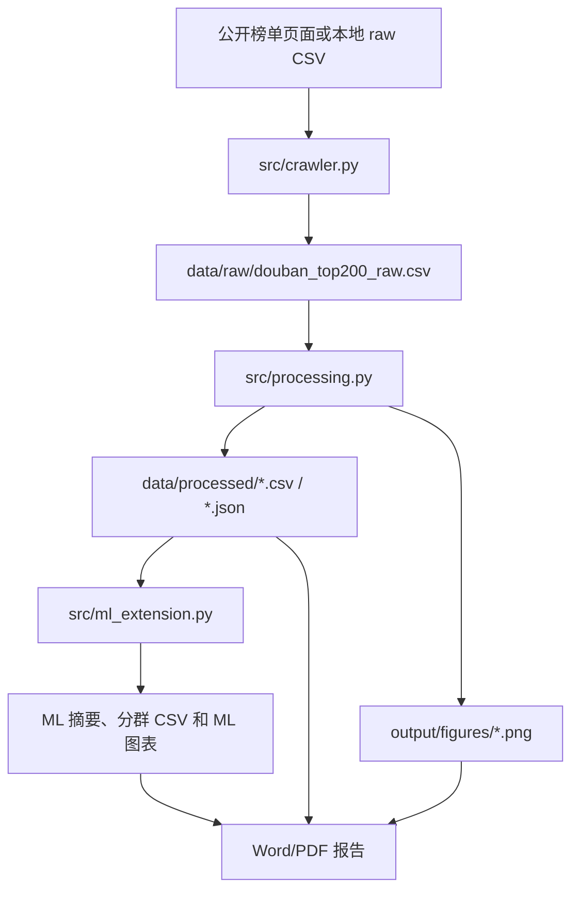

# Project Overview

## 结果概览

本项目分析豆瓣电影 Top250 公开榜单前 200 部影片，输出评分分布、类型结构、国家/地区来源、年代分布、排名关系和机器学习探索结果。GitHub 展示时优先呈现分析结论、图表和模型结果，复现步骤与工程实现作为后续支撑材料。

| 指标 | 当前结果 |
|---|---:|
| 清洗后电影数 | 200 |
| 平均评分 | 9.01 |
| 评分范围 | 8.5-9.7 |
| 年份跨度 | 1936-2023 |
| 累计评价人数 | 188,548,326 |
| 出现最多的类型 | 剧情 |
| 出现最多的国家/地区 | 美国 |
| 最佳机器学习模型 | Random forest |
| 最佳交叉验证 MAE | 0.1459 |
| 电影画像分群 | 4 类 |

## 主要发现

- Top200 影片评分集中在高分段，平均评分为 9.01。
- 剧情片是最主要的类型标签，出现 150 次。
- 美国电影出现 110 次，在国家/地区来源中占比最高。
- 1990 年代、2000 年代和 2010 年代影片构成榜单主体。
- 排名与评分之间存在明显关系，排名越靠前评分整体越高。
- 机器学习扩展显示，评价人数（对数）、年份和类型结构能解释一部分评分差异，但样本量小，结论应定位为探索性建模。
- KMeans 分群形成华语剧情高口碑片、欧美剧情经典片、悬疑惊悚与犯罪片、动画奇幻与冒险片 4 类电影画像。

## 输出成果

| 输出 | 说明 |
|---|---|
| `data/processed/movies_clean.csv` | 清洗后一电影一行的主表。 |
| `data/processed/movies_by_genre.csv` | 类型展开表，用于统计多类型影片。 |
| `data/processed/movies_by_country.csv` | 国家/地区展开表，用于统计合拍片来源。 |
| `data/processed/analysis_summary.json` | 自动生成的统计摘要。 |
| `data/processed/ml_summary.json` | 机器学习模型评估、特征重要性和分群摘要。 |
| `data/processed/movie_ml_clusters.csv` | 每部电影对应的分群标签。 |
| `output/figures/*.png` | 评分、类型、地区、年代、相关关系、模型评估和分群图表。 |
| `output/报告/豆瓣电影Top200数据分析报告_GitHub展示版.docx` | 面向项目展示的 Word 报告。 |

## 可复现流程



离线复现基础分析：

```powershell
.\.venv\Scripts\python.exe run_pipeline.py --skip-fetch --student-name "你的姓名" --student-id "你的学号" --class-name "你的班级"
```

运行机器学习扩展：

```powershell
.\.venv\Scripts\python.exe scripts\run_ml_extension.py
```

单独重建 GitHub 展示版 Word：

```powershell
.\.venv\Scripts\python.exe scripts\build_github_showcase_report.py
```

运行测试：

```powershell
.\.venv\Scripts\python.exe -m pytest -q
```

## 模块职责

| 模块 | 职责 |
|---|---|
| `src/crawler.py` | 访问公开榜单页面、解析电影条目、保存原始 CSV，并支持离线页面复查。 |
| `src/processing.py` | 清洗原始字段，拆分多值字段，生成统计摘要、质量报告和基础图表。 |
| `src/ml_extension.py` | 构造建模特征，执行评分预测交叉验证、特征重要性分析和 KMeans 分群。 |
| `src/reporting.py` | 生成课程提交版 Word 报告，调用桌面 LibreOffice 导出 PDF，并渲染页面用于检查。 |
| `scripts/build_github_showcase_report.py` | 生成去个人信息、面向项目展示的 GitHub 版 Word 报告。 |
| `scripts/run_ml_extension.py` | 单独运行机器学习扩展，刷新 ML 摘要、分群 CSV 和图表。 |
| `tests/` | 覆盖解析、清洗、去重、拆分、统计摘要和 ML 特征构造等核心逻辑。 |

## 质量控制

- 清洗后记录数保持为 200。
- 排名字段保持唯一。
- 年份、国家/地区、类型等关键字段清洗后不为空。
- 类型和国家/地区使用展开表分析，避免将多值文本当作单值类别。
- 机器学习模型使用 5 折交叉验证，并保留平均分基线作为对照。
- 测试用 fixture 覆盖页面解析、核心清洗逻辑和 ML 特征构造。

## 局限性

- 数据来自公开榜单页面，仅代表当次榜单快照。
- 榜单本身存在平台用户偏好，不应直接代表全部电影市场。
- 影片类型和国家/地区为多值字段，分析时以出现次数计数，不等同于影片唯一数量。
- 机器学习扩展使用小样本高分榜单数据，适合展示建模流程与特征解释，不适合作为真实评分预测系统。
