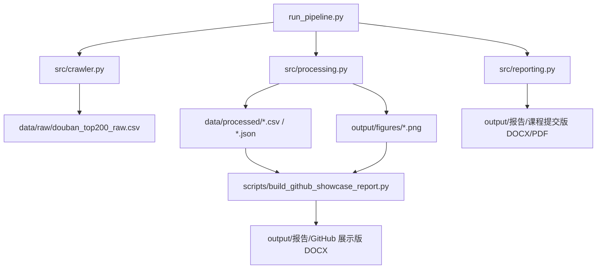

# Project Overview

## 项目定位

本项目是一个面向 GitHub 展示的 Python 数据分析工程样例。它以豆瓣电影 Top250 公开榜单前 200 部影片为对象，完整覆盖数据采集、清洗、质量核验、探索性分析、可视化和报告生成流程。

项目保留课程作业交付物，但 GitHub 展示重点放在工程过程和可复现性：审阅者可以从 README 快速了解项目价值，也可以通过 `run_pipeline.py` 或 `scripts/build_github_showcase_report.py` 复现核心输出。

## 目标

- 构建可重复执行的数据处理管道。
- 将网页列表数据转换为结构化 CSV 和统计摘要。
- 对电影评分、年代、类型、国家/地区和评价人数进行探索性分析。
- 生成适合课程提交和 GitHub 展示的双版本报告。
- 使用测试保护解析、清洗和统计逻辑的关键路径。

## 架构



## 模块职责

| 模块 | 职责 |
|---|---|
| `src/crawler.py` | 访问公开榜单页、解析电影条目、保存原始 CSV，并支持离线页面复查。 |
| `src/processing.py` | 清洗原始字段，拆分多值字段，生成统计摘要、质量报告和图表。 |
| `src/reporting.py` | 生成课程提交版 Word 报告，调用桌面 LibreOffice 导出 PDF，并渲染页面用于检查。 |
| `scripts/build_github_showcase_report.py` | 生成去个人信息、面向项目展示的 GitHub 版 Word 报告。 |
| `tests/` | 覆盖解析、清洗、去重、拆分和统计摘要等核心逻辑。 |

## 数据流程

1. 采集或复用原始 CSV。
2. 标准化排名、片名、年份、评分、评价人数等字段。
3. 拆分国家/地区和类型字段，生成展开表。
4. 输出质量报告，确认记录数、字段缺失和重复情况。
5. 生成统计摘要和可视化图表。
6. 生成课程版报告与 GitHub 展示版报告。

## 当前结果摘要

| 指标 | 当前结果 |
|---|---:|
| 清洗后电影数 | 200 |
| 平均评分 | 9.01 |
| 评分范围 | 8.5-9.7 |
| 年份跨度 | 1936-2023 |
| 累计评价人数 | 188,548,326 |
| 出现最多的类型 | 剧情 |
| 出现最多的国家/地区 | 美国 |

## 质量控制

- 清洗后记录数必须保持为 200。
- 排名字段必须唯一。
- 年份、国家/地区、类型等关键字段清洗后不应为空。
- 类型和国家/地区使用展开表分析，避免将多值文本当作单值类别。
- 测试用 fixture 覆盖页面解析和核心清洗逻辑。

## 复现方式

```powershell
.\.venv\Scripts\python.exe run_pipeline.py --skip-fetch --student-name "你的姓名" --student-id "你的学号" --class-name "你的班级"
.\.venv\Scripts\python.exe -m pytest -q
```

如只想刷新 GitHub 展示版 Word：

```powershell
.\.venv\Scripts\python.exe scripts\build_github_showcase_report.py
```

## 局限性

- 数据来自公开榜单页面，仅代表当次榜单快照。
- 榜单本身存在平台用户偏好，不能直接代表全部电影市场。
- 影片类型和国家/地区为多值字段，分析时以出现次数计数，不等同于影片唯一数量。
- 当前项目以探索性分析为主，未加入预测建模或交互式看板。
